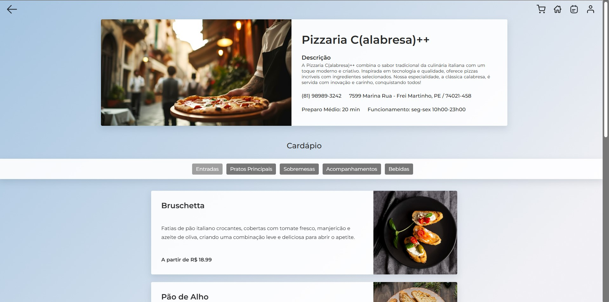
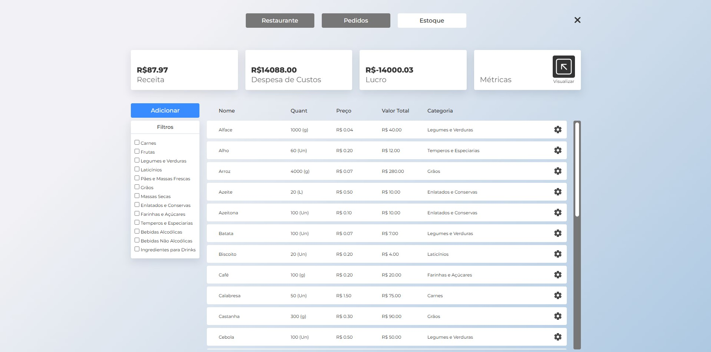

# Sistema de Gerenciamento de Restaurante
Aplicativo exclusivo de pedidos e gestão online para um restaurante, 
permitindo aos clientes visualizar o cardápio, fazer pedidos, 
enquanto o restaurante gerencia pedidos, estoque e pagamentos de forma centralizada.

# Instruções de uso
1- Abra o arquivo *globals.h* e substitua a variável *BASE_DIR* pelo caminho absoluto até a pasta banco de dados.

Exemplo:

```
const std::string BASE_DIR = "C:/Users/kddu4/ProjetoEDOO/ProjetoEDOO/banco_de_dados/";
```

2- No main.cpp substitua a variável *htmlPath* pelo caminho absoluto do arquivo *login.html* que está na pasta *front-end*.

Exemplo:

```
const char* htmlPath = "C:/Eu/Faculdade/ProjetoEDOO/ProjetoEDOO/ProjetoEDOO/front-end/login.html";
```

3- No main.cpp selecione o sistema operacional do seu computador:
```
   

    // string command = "start " + string(htmlPath); // Windows
    // string command = "xdg-open " + string(htmlPath); // Linux
    // string command = "open " + string(htmlPath); // Mac
```

4- Tudo pronto, pode rodar o main.cpp e testar o sistema!

# Fotos do Sistema em uso






